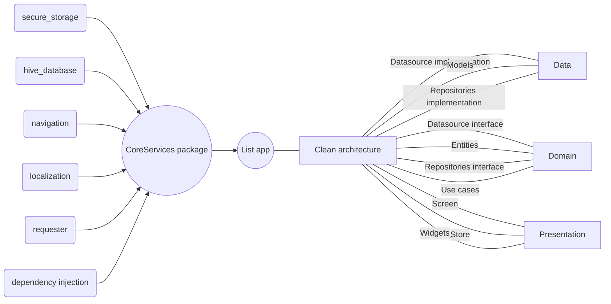

# lists_joao_nogueira

Arquivo .env e launch.json fornecidos para execução pelo vscode.
Para executar via linha de comando, fornecer o parâmetro `api` via `dart-define`

## Arquitetura

## Biblioteas de terceiros

  ### Gerencimaneto de estado
  mobx
  flutter_mobx
  mobx_codegen
  build_runner

  ### Custom widgets e utils
  top_snackbar_flutter
  flutter_launcher_icons
  validatorless: validação de campos

  ### Secure storage e banco de dados
  flutter_secure_storage
  hive
  hive_flutter
  hive_generator

  ### Recursos de programação funcional para tratamento de erros
  dartz

  ### Injeção de dependência
  get_it

  ### Localization
  intl

  ### Requester
  dio
  pretty_dio_logger

  ### Testes
  flutter_test
  mockito

## Requisitos não entregues

Telas de cadastro/edição de estudantes (as camadas de domínio e dados foram criados)
